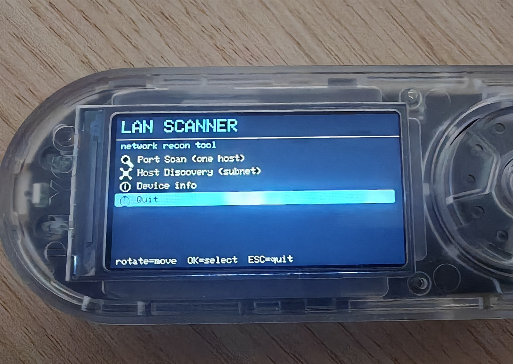
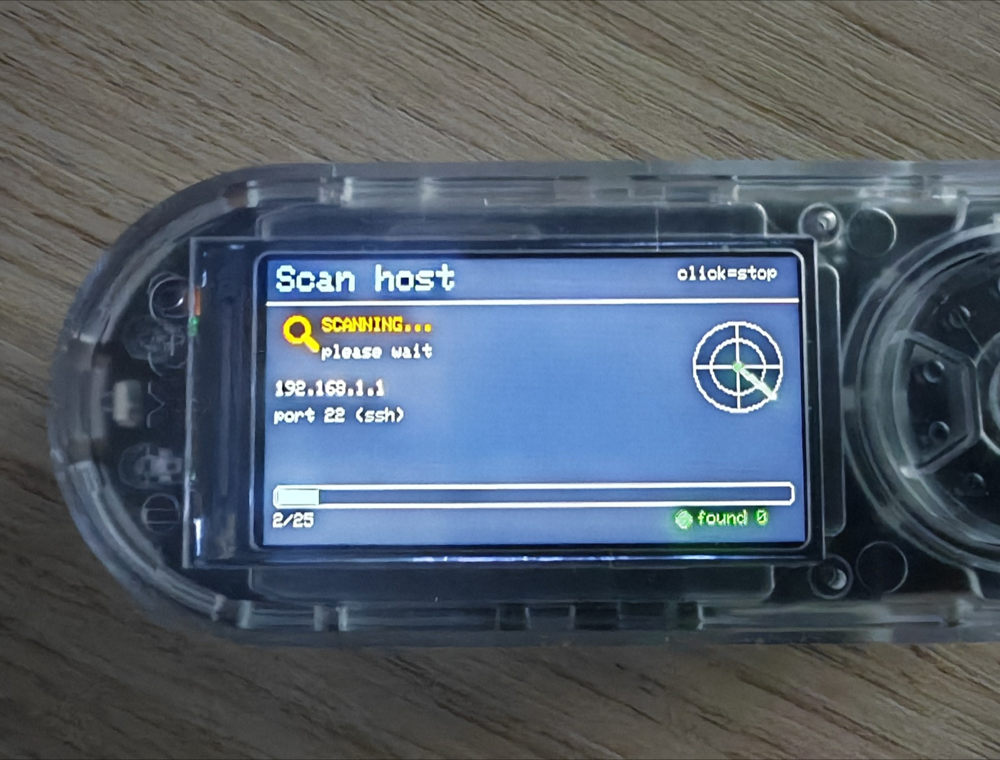
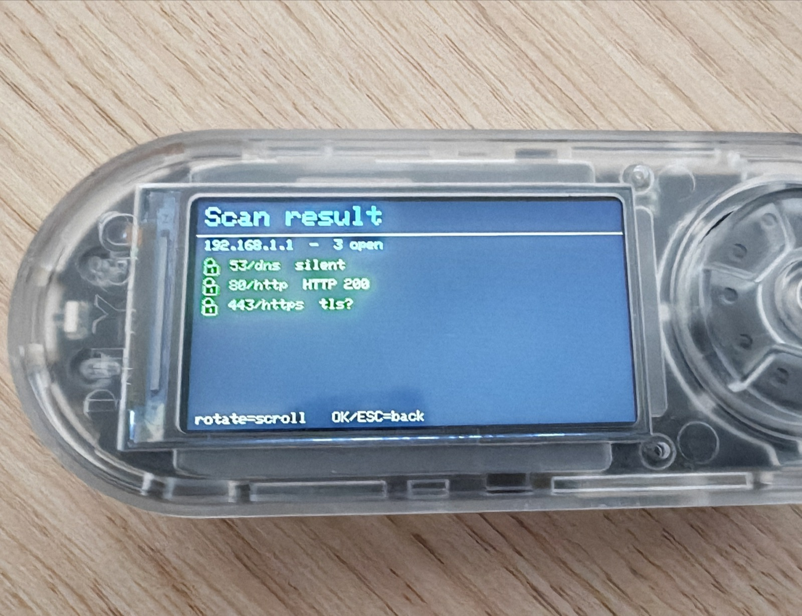
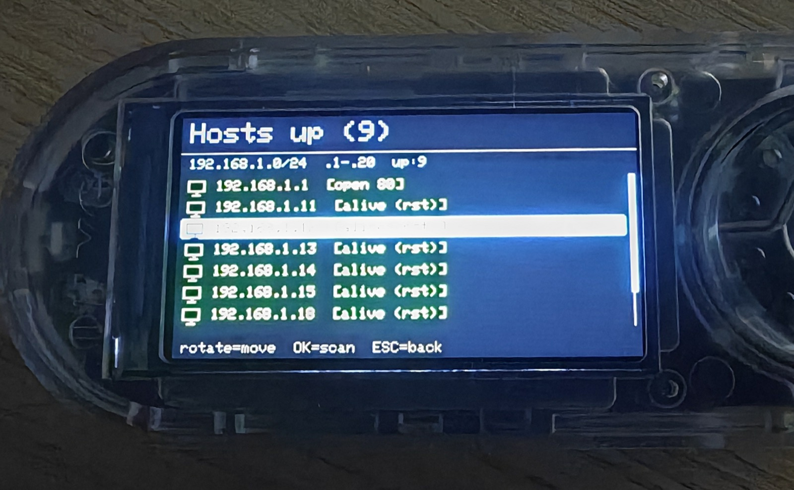

# 📡 LAN Scanner — Bruce / LilyGO T-Embed CC1101

  [-F7DF1E)](https://github.com/BruceDevices/firmware) 

> **EN** — A small **network recon tool** for the Bruce JS interpreter: scan the open ports of a host, discover live hosts on your subnet, and inspect web services (server type, page title & text) — all from the device, with a clean picto UI. No PC needed.

> **FR** — Un petit **outil de reconnaissance réseau** pour l'interpréteur JS de Bruce : scanner les ports ouverts d'une machine, découvrir les hôtes vivants du sous-réseau, et inspecter les services web (type de serveur, titre & texte de page) — le tout depuis l'appareil, avec une interface à pictogrammes. Sans PC.

## ✨ Features / Fonctions

- 🔍 **Port Scan** — scan ~25 common ports of a single host, with a live *scanning* screen (magnifier + sweeping radar + progress bar).
- 🕸️ **Host Discovery** — sweep a range of your `/24` to list live hosts (TCP-ping). Pick a host **right from the list** to port-scan it, then come back and pick another.
- 🔎 **Inspect a service** — click an open **web** port: it fetches the page and shows the **`Server:`** header (server type/version), **`X-Powered-By`**, the **`<title>`** and the page **text** (HTML stripped) — a tiny built-in text viewer.
- ⚡ **Liveness pre-check** — before a port scan, a quick check aborts fast if the host is down (so a wrong IP doesn't hang for minutes).
- 🎨 **Picto UI everywhere** — custom menus with icons, blue highlight, flicker-free scrollable results, radar/checkmark animations.

| Scanning | Port result | Host discovery |
|---|---|---|
|  |  |  |

## 🚀 Install

1. Copy **`Lan Scanner.js`** onto the SD card, e.g. into `/scripts` or `/BruceJS`.
2. On the device: **JS Interpreter → select `Lan Scanner.js`** (or add it to your favorites with [bruce-launcher](https://github.com/koua29/bruce-launcher)).
3. Controls: **rotate** = move, **click** = select/scan, **long-press (ESC)** or **click** = back.

## 🛠️ How it works

The Bruce JS interpreter **exposes no raw TCP socket** — only `wifi.httpFetch()` (an HTTP client). So each port is probed with an HTTP request and classified by **how the connection behaves**:

| Result | Meaning |
|---|---|
| HTTP object returned | **OPEN** (HTTP service, shows status code) |
| `no HTTP server` / `read timeout` / `connection lost` | **OPEN** (TCP accepted — non-HTTP or TLS service) |
| `connection refused` (fast) | **CLOSED** (host answered with RST → host is up) |
| `connection refused` (slow) | no answer (host down / filtered) |

Timing (`Date.now()`) separates a fast RST (port closed on a live host) from a slow connect-timeout (dead host).

## ⚠️ Limitations (honest)

- **Dead-IP timeout** — `httpFetch` uses `WiFiClient`, whose ~30 s connect timeout **can't be changed from JS** and **can't be interrupted mid-probe**. A live host answers in <1 s; a dead IP costs one timeout. Host Discovery therefore uses a single probe/host and warns you — keep ranges small.
- **HTTPS/TLS** — probed as plain HTTP: the open port is detected, but the page usually can't be rendered (self-signed cert / TLS). In that case the URL is shown so you can open it on a phone/PC.
- **No banner grab** — reading the raw banner of SSH/FTP/SMTP would need a raw socket (not available in BJS). Non-HTTP services are only identified by their well-known port. Web servers *are* fingerprinted via the `Server` header.
- **2.4 GHz only** and Wi-Fi must be connected (STA).

> Made for your **own** network / authorized testing.

## 🙏 Credits & License

- Script: **koua29** (Arnaud). Runs on the excellent **[Bruce firmware](https://github.com/BruceDevices/firmware)**.
- Released under the **MIT License** — see [LICENSE](LICENSE).

## ☕ Coffee?

---

## 🛒 Matériel / Hardware

Le matériel utilisé pour ce projet — liens affiliés Amazon :

|  |  |
|:---:|:---:|
| 🔌 **[LilyGO T-Embed CC1101](https://link.amazon/B0cgD7wou)** | 📡 **[Kit d'antennes SMA](https://link.amazon/B0eMlSqeZ)** |

En tant que Partenaire Amazon, je réalise un bénéfice sur les achats remplissant les conditions requises. · As an Amazon Associate I earn from qualifying purchases.
